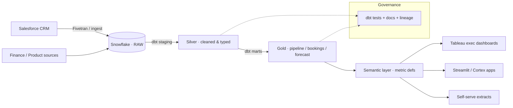

# GTM Single Source of Truth — dbt + Snowflake

> Production-grade Pipeline, Bookings & Forecasting models on Snowflake, adopted by the CFO as the
> single source of truth for **$300M+ ARR** planning. Manual report prep cut **75%**.

`Snowflake` · `dbt` · `Medallion (bronze/silver/gold)` · `Semantic layer` · `Salesforce` · `Tableau`

---

## Problem
Leadership reconciled pipeline, bookings, and forecast numbers from conflicting spreadsheets and
one-off SQL. Metric definitions drifted between teams, so the same KPI told different stories in
different rooms — and every planning cycle burned days of manual prep.

## Approach
A layered dbt project on Snowflake with tested, documented metric definitions and a governed
semantic layer, so every downstream asset consumes the *same* logic.



**Layers**
- **Bronze / RAW** — landed source data (Salesforce opportunities, accounts, users, territories).
- **Silver (staging)** — cleaned, typed, standardized; one row-grain per entity; naming conventions enforced.
- **Gold (marts)** — business-facing facts: pipeline, bookings, win rate, forecast by segment × quarter.
- **Semantic layer** — canonical metric definitions (ARR, coverage, win rate) consumed by all BI.

## Engineering practices
- `dbt test` on every model: uniqueness, not-null, relationships, accepted-values, and custom
  metric-reconciliation tests.
- `dbt docs` for lineage + metric definitions — the "documentation-first" contract.
- CI on pull requests; models promoted only when tests pass.

## Impact
| Metric | Result |
|--------|--------|
| ARR planning powered | **$300M+** |
| Manual report prep | **−75%** |
| Metric definitions | Single, tested, documented source |
| Executive analysis cycle | Faster, self-serve |

## Repo layout (reference)
```
models/
  staging/      # silver: stg_salesforce__opportunities.sql, ...
  marts/        # gold:   fct_pipeline.sql, fct_bookings.sql, dim_account.sql
  semantic/     # metric definitions / exposures
tests/          # custom data tests
dbt_project.yml
```

## Screenshots
`docs/` → add exec-dashboard screenshots + `dbt docs` lineage graph here.

> Data note: figures reflect real project impact; any company-confidential values are generalized.
